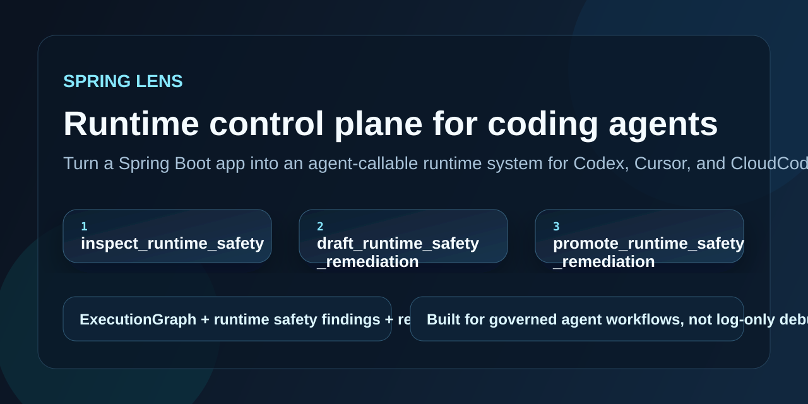
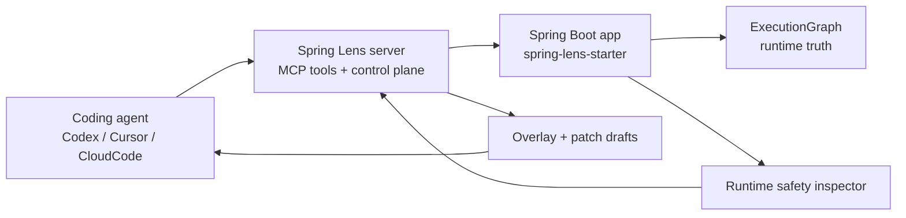

# Spring Lens

[](https://github.com/HeJiguang/SpringLens/actions/workflows/ci.yml)
[](https://github.com/HeJiguang/SpringLens/blob/main/LICENSE)

[English](./README.md) | [简体中文](./README.zh-CN.md)

Spring Lens turns a Spring Boot application into an agent-callable runtime system for Codex, Cursor, CloudCode, and other MCP clients.



## Architecture



## Quickstart

1. Build and test the workspace.

   ```bash
   mvn test
   ```

2. Start the control plane.

   ```bash
   mvn -f spring-lens-server/pom.xml spring-boot:run
   ```

3. Start the demo application and register it with the control plane.

   ```bash
   mvn -pl spring-lens-demo-app -am clean install -DskipTests "-Dspring-boot.repackage.skip=true"
   mvn -f spring-lens-demo-app/pom.xml spring-boot:run "-Dspring-boot.run.arguments=--server.port=8081 --spring.lens.registration-enabled=true --spring.lens.server-url=http://localhost:8090 --spring.lens.runtime-base-url=http://localhost:8081"
   ```

## Real Demo Flow

This is the product loop worth showing in a 30 to 60 second GIF:

1. Trigger a request against the demo app.

   ```text
   GET http://localhost:8081/orders/fail
   ```

2. Ask Spring Lens what is unsafe in the live runtime.

   ```text
   inspect_runtime_safety
   ```

3. Ask Spring Lens to turn those findings into reviewable remediation drafts.

   ```text
   draft_runtime_safety_remediation
   ```

4. Promote the approved draft into the control plane.

   ```text
   promote_runtime_safety_remediation
   ```

This gives coding agents a higher-level workflow than "read logs and guess":

- inspect concrete runtime safety risks
- generate overlay and patch drafts
- promote reviewed remediation into a governed control plane

## What Spring Lens Helps Coding Agents Do

- Inspect runtime behavior through execution graphs instead of raw log scraping.
- Ask high-level runtime questions such as slow SQL, exception context, and safety risks.
- Turn runtime findings into reviewable overlays and patch drafts instead of ad hoc debugging notes.
- Keep runtime, server, and governance concerns separated so agent workflows stay auditable.
- Extend project-specific tools through SPI and `@LensTool` without coupling business logic into the core.

## Why It Exists

Most coding agents can read source code well, but they are weak at understanding what a Spring Boot service is doing right now.

Spring Lens gives them a runtime surface that is:

- task-oriented instead of dump-oriented
- structured instead of log-shaped
- governable instead of "agent wrote instrumentation directly into prod"

## Modules

- `spring-lens-model`
  Shared runtime graph model and transport DTOs.
- `spring-lens-spi`
  SPI contracts for collectors, capabilities, tools, and playbooks.
- `spring-lens-runtime`
  Execution graph assembly and built-in runtime collectors.
- `spring-lens-starter`
  Default application-side starter for runtime truth and AI-facing tools.
- `spring-lens-agent-contract`
  Shared contracts for overlays, patch drafts, and instrumentation governance.
- `spring-lens-agent-starter`
  Higher-trust agent extension for overlay sync and future instrumentation control.
- `spring-lens-server`
  External control plane, tool router, MCP surface, and governance flows.
- `spring-lens-demo-app`
  Runnable H2-backed demo application used by tests and demos.

## Built-in Tooling

Runtime and diagnosis:

- `list_registered_apps`
- `get_slow_sql`
- `get_exception_context`
- `get_execution_graph`
- `diagnose_execution_graph`
- `get_diagnostic_playbook`
- `list_runtime_tools`
- `invoke_runtime_tool`
- `query_probe_values`
- `inspect_runtime_safety`
- `plan_runtime_safety_remediation`

Control plane:

- `get_policy_snapshot`
- `list_active_overlays`
- `list_patch_drafts`
- `apply_overlay_instrumentation`
- `approve_overlay_instrumentation`
- `disable_overlay_instrumentation`
- `list_audit_events`
- `draft_runtime_safety_remediation`
- `promote_runtime_safety_remediation`

## Agent Integrations

Spring Lens now ships repository-local integration guides and reusable skills:

- [Codex integration guide](./docs/integrations/codex.md)
- [CloudCode integration guide](./docs/integrations/cloudcode.md)
- [Agent skills overview](./skills/README.md)
- [Codex runtime safety skill](./skills/codex/spring-lens-runtime-safety/SKILL.md)
- [CloudCode runtime safety skill](./skills/cloudcode/spring-lens-runtime-safety.md)

## Release

- [v0.1.0 release notes draft](./docs/releases/v0.1.0.md)
- [GitHub social preview source and usage notes](./assets/github/README.md)
- [Show and tell discussion draft](./docs/community/show-and-tell-discussion.md)

## Detailed Docs

- [Product overview](./docs/overview.md)
- [Codex integration](./docs/integrations/codex.md)
- [CloudCode integration](./docs/integrations/cloudcode.md)
- [Runtime safety demo storyboard](./docs/demo/runtime-safety-flow.md)

## Community

- [Contributing guide](./CONTRIBUTING.md)
- [Code of conduct](./CODE_OF_CONDUCT.md)
- [Security policy](./SECURITY.md)
- [Support](./SUPPORT.md)

