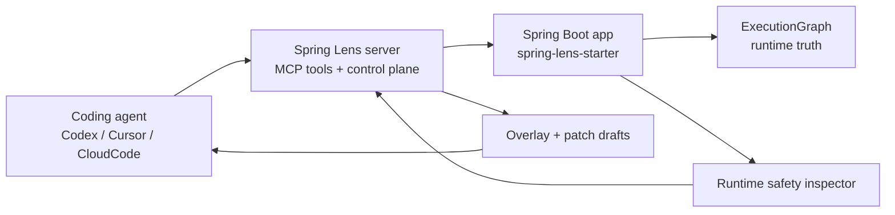

# Spring Lens

[](https://github.com/HeJiguang/SpringLens/actions/workflows/ci.yml)
[](https://github.com/HeJiguang/SpringLens/blob/main/LICENSE)

[English](./README.md) | [简体中文](./README.zh-CN.md)

Spring Lens is a runtime control plane for Spring Boot applications. It gives coding agents a structured way to inspect live behavior, ask high-value runtime questions, and turn findings into reviewable remediation workflows.


## Why Spring Lens

Most coding agents can read source code well. They are much weaker at answering the harder questions that only show up at runtime:

- What actually happened in this request?
- Which SQL call was slow?
- What state was present when the exception was thrown?
- Is this service carrying concurrency or retention risks that are not obvious in a code diff?

Spring Lens addresses that gap by exposing runtime truth as:

- execution graphs instead of log archaeology
- task-oriented tools instead of raw bean dumps
- governed remediation flows instead of ad hoc instrumentation

## Architecture



## Quickstart

1. Build and test the workspace.

   ```bash
   mvn test
   ```

2. Start the control plane.

   ```bash
   mvn -f spring-lens-server/pom.xml spring-boot:run
   ```

3. Start the demo application and register it with the control plane.

   ```bash
   mvn -pl spring-lens-demo-app -am clean install -DskipTests "-Dspring-boot.repackage.skip=true"
   mvn -f spring-lens-demo-app/pom.xml spring-boot:run "-Dspring-boot.run.arguments=--server.port=8081 --spring.lens.registration-enabled=true --spring.lens.server-url=http://localhost:8090 --spring.lens.runtime-base-url=http://localhost:8081"
   ```

## Demo Flow

The clearest end-to-end flow in the current repository is:

1. Trigger a request against the demo app.

   ```text
   GET http://localhost:8081/orders/fail
   ```

2. Inspect runtime safety in the live application.

   ```text
   inspect_runtime_safety
   ```

3. Draft remediation from those findings.

   ```text
   draft_runtime_safety_remediation
   ```

4. Promote the reviewed remediation into the control plane.

   ```text
   promote_runtime_safety_remediation
   ```

That flow is what makes Spring Lens different from a debugging helper. It connects live runtime evidence to a governed remediation path.

## What It Helps With

- Inspect real request behavior through execution graphs.
- Pull slow SQL and exception context without adding one-off debug endpoints.
- Expose project-specific runtime tools through SPI and `@LensTool`.
- Detect runtime safety issues before proposing concurrency-related fixes.
- Turn findings into reviewable overlay and patch drafts.

## Modules

- `spring-lens-model`
  Shared runtime graph model and transport DTOs.
- `spring-lens-spi`
  SPI contracts for collectors, capabilities, tools, and playbooks.
- `spring-lens-runtime`
  Execution graph assembly and built-in runtime collectors.
- `spring-lens-starter`
  Default application-side starter for runtime truth and AI-facing tools.
- `spring-lens-agent-contract`
  Shared contracts for overlays, patch drafts, and instrumentation governance.
- `spring-lens-agent-starter`
  Higher-trust extension for overlay sync and future instrumentation control.
- `spring-lens-server`
  External control plane, tool router, MCP surface, and governance flows.
- `spring-lens-demo-app`
  Runnable H2-backed demo application used by tests and demos.

## Built-in Tools

Runtime and diagnosis:

- `list_registered_apps`
- `get_slow_sql`
- `get_exception_context`
- `get_execution_graph`
- `diagnose_execution_graph`
- `get_diagnostic_playbook`
- `list_runtime_tools`
- `invoke_runtime_tool`
- `query_probe_values`
- `inspect_runtime_safety`
- `plan_runtime_safety_remediation`

Control plane:

- `get_policy_snapshot`
- `list_active_overlays`
- `list_patch_drafts`
- `apply_overlay_instrumentation`
- `approve_overlay_instrumentation`
- `disable_overlay_instrumentation`
- `list_audit_events`
- `draft_runtime_safety_remediation`
- `promote_runtime_safety_remediation`

## Integrations

Spring Lens includes repository-local onboarding material for editor and agent workflows:

- [Codex integration guide](./docs/integrations/codex.md)
- [CloudCode integration guide](./docs/integrations/cloudcode.md)
- [Skills overview](./skills/README.md)
- [Codex runtime safety skill](./skills/codex/spring-lens-runtime-safety/SKILL.md)
- [CloudCode runtime safety guidance](./skills/cloudcode/spring-lens-runtime-safety.md)

## Release and Demo Assets

- [v0.1.0 release notes](./docs/releases/v0.1.0.md)
- [GitHub social preview source and usage notes](./assets/github/README.md)
- [Runtime safety demo storyboard](./docs/demo/runtime-safety-flow.md)
- [Show and tell discussion post](./docs/community/show-and-tell-discussion.md)

## Additional Docs

- [Project overview](./docs/overview.md)
- [Codex integration](./docs/integrations/codex.md)
- [CloudCode integration](./docs/integrations/cloudcode.md)

## Community

- [Contributing guide](./CONTRIBUTING.md)
- [Code of conduct](./CODE_OF_CONDUCT.md)
- [Security policy](./SECURITY.md)
- [Support](./SUPPORT.md)

