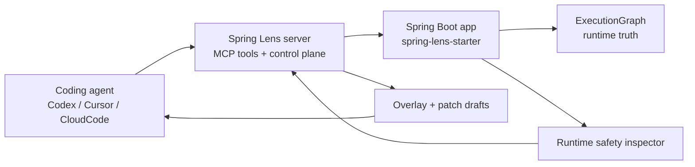

# Spring Lens

[](https://github.com/HeJiguang/SpringLens/actions/workflows/ci.yml)
[](https://github.com/HeJiguang/SpringLens/blob/main/LICENSE)

[English](./README.md) | [简体中文](./README.zh-CN.md)

Spring Lens 会把一个 Spring Boot 应用变成一个可被 Codex、Cursor、CloudCode 以及其他 MCP 客户端直接调用的运行时系统。


## 架构图



## 快速开始

1. 先构建并跑完整测试。

   ```bash
   mvn test
   ```

2. 启动控制平面。

   ```bash
   mvn -f spring-lens-server/pom.xml spring-boot:run
   ```

3. 启动 demo 应用，并让它注册到控制平面。

   ```bash
   mvn -pl spring-lens-demo-app -am clean install -DskipTests "-Dspring-boot.repackage.skip=true"
   mvn -f spring-lens-demo-app/pom.xml spring-boot:run "-Dspring-boot.run.arguments=--server.port=8081 --spring.lens.registration-enabled=true --spring.lens.server-url=http://localhost:8090 --spring.lens.runtime-base-url=http://localhost:8081"
   ```

## 真实 Demo Flow

这条链路最值得做成 30 到 60 秒的 GIF：

1. 先触发一次 demo 请求。

   ```text
   GET http://localhost:8081/orders/fail
   ```

2. 让 Spring Lens 检查当前运行时里有哪些安全风险。

   ```text
   inspect_runtime_safety
   ```

3. 让 Spring Lens 把这些风险转成可审阅的治理草案。

   ```text
   draft_runtime_safety_remediation
   ```

4. 把通过审阅的草案提升进控制平面。

   ```text
   promote_runtime_safety_remediation
   ```

这条链路的价值在于，Coding Agent 不再只是“读日志然后猜”：

- 它先看真实运行时的安全风险
- 再生成 overlay 和 patch 草案
- 最后把结果放进可治理的控制平面

## Spring Lens 能帮 Coding Agent 做什么

- 用 ExecutionGraph 理解运行时行为，而不是只靠日志。
- 直接提问高层运行时问题，例如慢 SQL、异常上下文、运行时安全风险。
- 把运行时发现转成可审阅的 overlay 和 patch draft，而不是临时调试笔记。
- 保持 runtime、server、governance 解耦，让 agent 工作流可以被审计和治理。
- 通过 SPI 和 `@LensTool` 扩展业务工具，而不是把业务逻辑硬塞进核心层。

## 为什么要做它

多数 Coding Agent 很擅长读源码，但并不真正知道一个 Spring Boot 服务“现在正在干什么”。

Spring Lens 给它们提供的是一层运行时表面，而且这层表面具备几个特征：

- 面向任务，而不是面向原始数据 dump
- 结构化，而不是日志形状
- 可治理，而不是让 agent 直接往线上写探针

## 模块

- `spring-lens-model`
  共享的运行时图模型和传输 DTO。
- `spring-lens-spi`
  collector、capability、tool、playbook 的 SPI 契约。
- `spring-lens-runtime`
  ExecutionGraph 组装与内置运行时采集。
- `spring-lens-starter`
  默认应用侧 starter，负责运行时真相和 AI 可调用工具。
- `spring-lens-agent-contract`
  overlay、patch draft、instrumentation governance 的共享契约。
- `spring-lens-agent-starter`
  更高信任级别的 agent 扩展，用于 overlay 同步和后续 instrumentation 控制。
- `spring-lens-server`
  外部控制平面、工具路由、MCP 接口和治理流。
- `spring-lens-demo-app`
  基于 H2 的可运行 demo 应用，用于测试和演示。

## 内置工具

运行时与诊断：

- `list_registered_apps`
- `get_slow_sql`
- `get_exception_context`
- `get_execution_graph`
- `diagnose_execution_graph`
- `get_diagnostic_playbook`
- `list_runtime_tools`
- `invoke_runtime_tool`
- `query_probe_values`
- `inspect_runtime_safety`
- `plan_runtime_safety_remediation`

控制平面：

- `get_policy_snapshot`
- `list_active_overlays`
- `list_patch_drafts`
- `apply_overlay_instrumentation`
- `approve_overlay_instrumentation`
- `disable_overlay_instrumentation`
- `list_audit_events`
- `draft_runtime_safety_remediation`
- `promote_runtime_safety_remediation`

## Agent 接入

仓库现在附带了可直接复用的接入文档和 skills：

- [Codex 接入指南](./docs/integrations/codex.md)
- [CloudCode 接入指南](./docs/integrations/cloudcode.md)
- [Agent Skills 总览](./skills/README.md)
- [Codex runtime safety skill](./skills/codex/spring-lens-runtime-safety/SKILL.md)
- [CloudCode runtime safety skill](./skills/cloudcode/spring-lens-runtime-safety.md)

## Release

- [v0.1.0 release notes 草稿](./docs/releases/v0.1.0.md)
- [GitHub social preview 图源与使用说明](./assets/github/README.md)
- [Show and tell Discussions 帖子草稿](./docs/community/show-and-tell-discussion.md)

## 详细文档

- [产品说明](./docs/overview.md)
- [Codex 接入](./docs/integrations/codex.md)
- [CloudCode 接入](./docs/integrations/cloudcode.md)
- [运行时安全演示脚本](./docs/demo/runtime-safety-flow.md)

## 社区

- [贡献指南](./CONTRIBUTING.md)
- [行为准则](./CODE_OF_CONDUCT.md)
- [安全策略](./SECURITY.md)
- [支持渠道](./SUPPORT.md)

