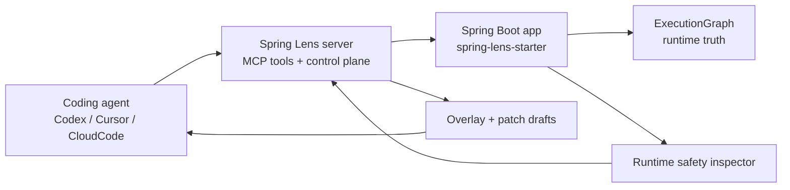

# Spring Lens

[](https://github.com/HeJiguang/SpringLens/actions/workflows/ci.yml)
[](https://github.com/HeJiguang/SpringLens/blob/main/LICENSE)

[English](./README.md) | [简体中文](./README.zh-CN.md)

Spring Lens 是一个面向 Spring Boot 的运行时控制平面。它让 Coding Agent 不只会读源码，还能基于真实运行时行为完成排查、诊断和可审阅的治理流程。


## 为什么需要 Spring Lens

多数 Coding Agent 很擅长读源码，但一到运行时问题就会明显变弱，例如：

- 这次请求到底发生了什么？
- 哪条 SQL 真正慢了？
- 抛异常时上下文是什么？
- 服务里有没有代码 diff 看不出来的并发风险或内存滞留风险？

Spring Lens 解决的是这类问题。它把运行时真相暴露成：

- ExecutionGraph，而不是日志考古
- 面向任务的工具，而不是原始 bean dump
- 可治理的 remediation flow，而不是临时加探针

## 架构图



## 快速开始

1. 先构建并运行完整测试。

   ```bash
   mvn test
   ```

2. 启动控制平面。

   ```bash
   mvn -f spring-lens-server/pom.xml spring-boot:run
   ```

3. 启动 demo 应用，并让它注册到控制平面。

   ```bash
   mvn -pl spring-lens-demo-app -am clean install -DskipTests "-Dspring-boot.repackage.skip=true"
   mvn -f spring-lens-demo-app/pom.xml spring-boot:run "-Dspring-boot.run.arguments=--server.port=8081 --spring.lens.registration-enabled=true --spring.lens.server-url=http://localhost:8090 --spring.lens.runtime-base-url=http://localhost:8081"
   ```

## Demo Flow

当前仓库里最值得演示的一条链路是：

1. 先触发一次 demo 请求。

   ```text
   GET http://localhost:8081/orders/fail
   ```

2. 检查 live runtime 里的安全风险。

   ```text
   inspect_runtime_safety
   ```

3. 基于这些发现生成 remediation draft。

   ```text
   draft_runtime_safety_remediation
   ```

4. 把审阅通过的 remediation 提升进控制平面。

   ```text
   promote_runtime_safety_remediation
   ```

这条链路能体现 Spring Lens 的核心价值：把真实运行时证据连接到一个可治理、可审阅的修复流程里。

## 它能解决什么问题

- 通过 ExecutionGraph 看清真实请求行为。
- 不用额外加调试接口，就能拿到慢 SQL 和异常上下文。
- 通过 SPI 和 `@LensTool` 暴露项目自己的运行时工具。
- 在改并发相关代码之前先识别运行时安全风险。
- 把运行时发现转换成可审阅的 overlay 和 patch draft。

## 模块

- `spring-lens-model`
  共享的运行时图模型和传输 DTO。
- `spring-lens-spi`
  collector、capability、tool、playbook 的 SPI 契约。
- `spring-lens-runtime`
  ExecutionGraph 组装与内置运行时采集。
- `spring-lens-starter`
  默认应用侧 starter，负责运行时真相和 AI 可调用工具。
- `spring-lens-agent-contract`
  overlay、patch draft、instrumentation governance 的共享契约。
- `spring-lens-agent-starter`
  更高信任级别的扩展，用于 overlay 同步和后续 instrumentation 控制。
- `spring-lens-server`
  外部控制平面、工具路由、MCP 接口和治理流。
- `spring-lens-demo-app`
  基于 H2 的可运行 demo 应用，用于测试和演示。

## 内置工具

运行时与诊断：

- `list_registered_apps`
- `get_slow_sql`
- `get_exception_context`
- `get_execution_graph`
- `diagnose_execution_graph`
- `get_diagnostic_playbook`
- `list_runtime_tools`
- `invoke_runtime_tool`
- `query_probe_values`
- `inspect_runtime_safety`
- `plan_runtime_safety_remediation`

控制平面：

- `get_policy_snapshot`
- `list_active_overlays`
- `list_patch_drafts`
- `apply_overlay_instrumentation`
- `approve_overlay_instrumentation`
- `disable_overlay_instrumentation`
- `list_audit_events`
- `draft_runtime_safety_remediation`
- `promote_runtime_safety_remediation`

## 接入文档

仓库附带了面向实际接入场景的文档和 skills：

- [Codex 接入指南](./docs/integrations/codex.md)
- [CloudCode 接入指南](./docs/integrations/cloudcode.md)
- [Skills 总览](./skills/README.md)
- [Codex runtime safety skill](./skills/codex/spring-lens-runtime-safety/SKILL.md)
- [CloudCode runtime safety guidance](./skills/cloudcode/spring-lens-runtime-safety.md)

## Release 与演示资产

- [v0.1.0 release notes](./docs/releases/v0.1.0.md)
- [GitHub social preview 图源与使用说明](./assets/github/README.md)
- [Runtime safety demo 脚本](./docs/demo/runtime-safety-flow.md)
- [Show and tell Discussions 帖子](./docs/community/show-and-tell-discussion.md)

## 更多文档

- [项目概览](./docs/overview.md)
- [Codex 接入](./docs/integrations/codex.md)
- [CloudCode 接入](./docs/integrations/cloudcode.md)

## 社区

- [贡献指南](./CONTRIBUTING.md)
- [行为准则](./CODE_OF_CONDUCT.md)
- [安全策略](./SECURITY.md)
- [支持渠道](./SUPPORT.md)

